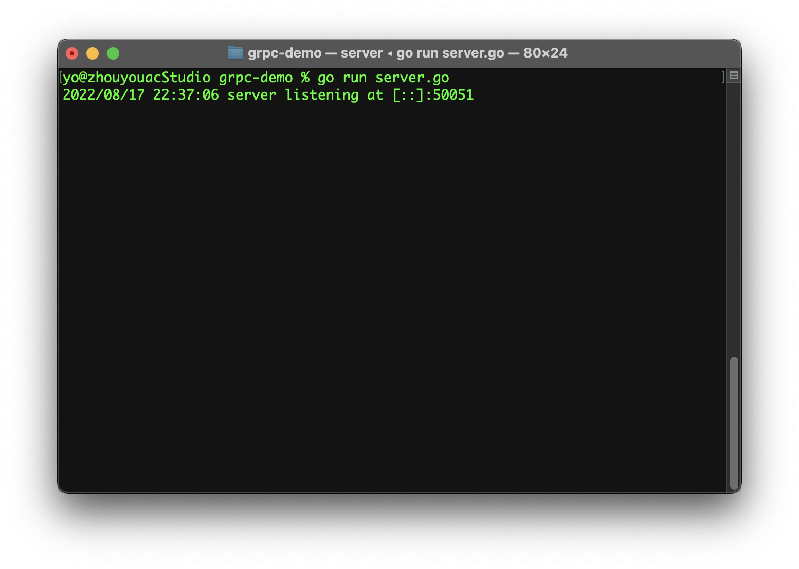
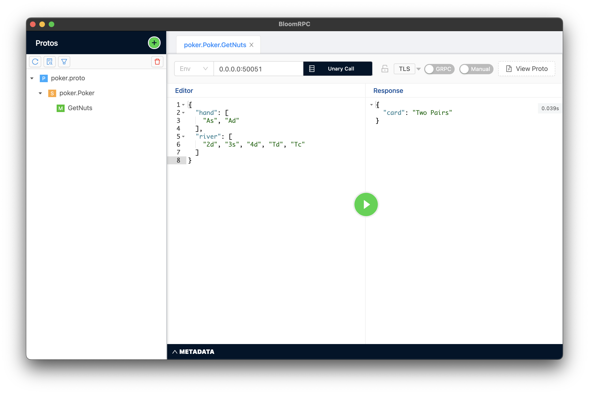

## grpc-demo

### 說明
實作一個可以透過 grpc 的方式進行資料交換的伺服器。 
範例的內容為德州撲克的規則，依照輸入的撲克牌類型，回覆對應的牌型。 
如果對於德州撲克轉換或是勝率有興趣也可以參考我另一個專案 [poker-hand-evaluator](https://github.com/xup6m6fu04/poker-hand-evaluator)

### 運行方式
1. `go run server.go` 
2. 使用 [BloomRPC](https://github.com/bloomrpc/bloomrpc)，先匯入 proto 檔，就可以運行測試。 

### 參考資料
https://grpc.io/docs/languages/go/quickstart/  
https://github.com/grpc/grpc-go/tree/master/examples/helloworld  
https://developers.google.com/protocol-buffers/docs/gotutorial  
